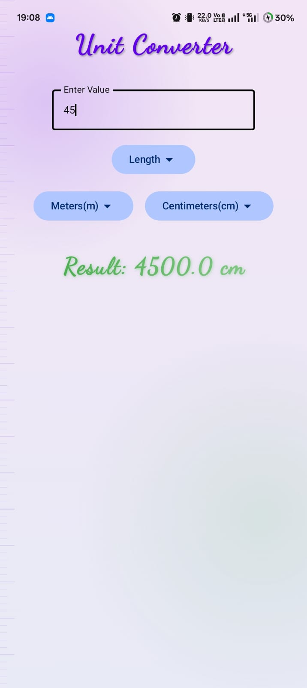
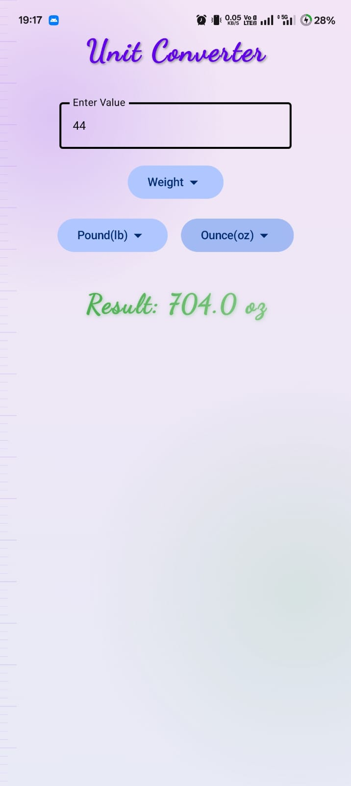

# 📏 Unit Converter Android App

A modern, fast, and elegant Android application built with **Jetpack Compose** and **Material 3** for instant conversion across multiple unit categories including **Length**, **Weight**, and **Temperature**.

---

## 📱 Screenshots

<p align="center">
  
  &nbsp;&nbsp;&nbsp;&nbsp;
  
</p>

---

## 🌟 Features

- **⚡ Real-Time Instant Conversion**: Values are calculated and updated live as you type.
- **📐 Length Conversions**: Convert between millimeters, centimeters, meters, kilometers, feet, inches, yards, and miles.
- **⚖️ Weight Conversions**: Easily convert milligrams, grams, kilograms, metric tons, pounds, and ounces.
- **🌡️ Temperature Conversions**: Precise conversions across Celsius (°C), Fahrenheit (°F), and Kelvin (K).
- **🎨 Sleek Material 3 UI**: Clean user interface featuring custom typography, responsive dropdowns, and high-contrast text fields.
- **🌌 Dynamic Background Canvas**: Custom ambient vector graphics and smooth gradient backgrounds (`ConverterBackground`).
- **🛡️ Input Validation**: Built-in validation that alerts users on invalid non-numeric input using toast notifications.

---

## 🔄 Supported Categories & Units

| Category | Supported Units |
| :--- | :--- |
| **📏 Length** | Millimeters (`mm`), Centimeters (`cm`), Meters (`m`), Kilometers (`km`), Feet (`ft`), Inches (`in`), Yards (`yd`), Miles (`mi`) |
| **⚖️ Weight** | Milligrams (`mg`), Grams (`g`), Kilograms (`kg`), Metric Tons (`t`), Pounds (`lb`), Ounces (`oz`) |
| **🌡️ Temperature** | Celsius (`°C`), Fahrenheit (`°F`), Kelvin (`K`) |

---

## 🛠️ Tech Stack & Architecture

- **Language**: [Kotlin](https://kotlinlang.org/)
- **UI Toolkit**: [Jetpack Compose](https://developer.android.com/jetpack/compose) (Material 3)
- **Architecture**: Single Activity Compose Architecture (`ComponentActivity`)
- **State Management**: Compose State (`mutableStateOf`, `mutableDoubleStateOf`, `remember`)
- **Target SDK**: 35 (Android 15)
- **Compile SDK**: 36
- **Min SDK**: 24 (Android 7.0)

---

## 🚀 Getting Started

### Prerequisites
- Android Studio Ladybug or newer
- JDK 17 / 21
- Android SDK 35+

### Build & Run
1. **Clone the repository**:
   ```bash
   git clone https://github.com/your-username/UnitConverter.git
   cd UnitConverter
   ```
2. **Open in Android Studio**:
   Open the project folder in Android Studio and let Gradle sync.
3. **Run the App**:
   Connect an Android device or start an emulator, then run `./gradlew installDebug` or click **Run ▶** in Android Studio.

---

## 📄 License
This project is open source and available under the [MIT License](LICENSE).
